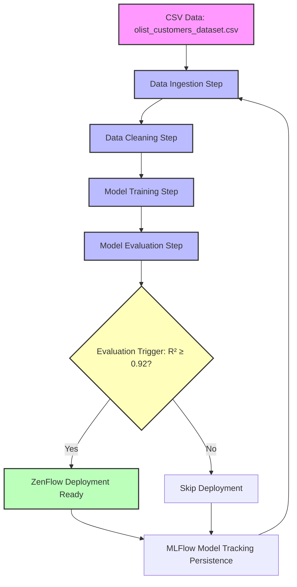

# MLOps Orchestrator: Customer Satisfaction Prediction 

[](https://www.python.org/)[](https://www.zenml.io/)[](https://mlflow.org/)[](https://www.docker.com/)[](https://mlops.community/)

---

## Project Overview

This project demonstrates a **modular, reusable, and production-ready machine learning (ML) pipeline** using **ZenML** for orchestration and **MLFlow** as an experiment tracker. The entire pipeline is **containerized using Docker Compose**, ensuring reproducibility, reliability, and seamless deployment in any environment.

The core focus of this project is the **pipeline infrastructure** rather than the machine learning model itself. It implements best practices of **MLOps, Continuous Integration (CI), and Continuous Delivery (CD)**, allowing for automated ingestion, processing, model training, evaluation, and deployment.

The ML workflow is designed using **Object-Oriented Programming (OOP) principles** and the **Strategy Design Pattern**, enabling easy extension or substitution of components like data preprocessing, splitting, and model evaluation.

---

## Pipeline Architecture

The pipeline is divided into **two main ZenML pipelines**:

### 1️⃣ Training Pipeline (`training_pipeline.py`)

- **Steps:**
  1. **Data Ingestion:** Reads raw CSV files into a Pandas DataFrame.
  2. **Data Cleaning:** Handles missing values, drops irrelevant features, and splits the dataset.
  3. **Model Training:** Trains a Scikit-Learn `LinearRegression` model.
  4. **Model Evaluation:** Computes metrics including R², Mean Squared Error (MSE), and Root Mean Squared Error (RMSE).

- **Purpose:** Provides a reusable and modular pipeline for experimenting with different models and preprocessing strategies.

---

### 2️⃣ Continuous Deployment Pipeline (`deployment_pipeline.py`)

- **Steps:**
  1. Executes the **Training Pipeline** as the first step.
  2. **Evaluation Trigger:** Only allows deployment if the model meets a predefined accuracy threshold (default R² ≥ 0.92).
  3. **Model Deployment:** Uses **MLFlowModelDeployer** to deploy models into a production-ready Docker container.

- **Purpose:** Automates deployment of trained models, ensuring only high-performing models are deployed, adhering to CI/CD best practices.

---

## Dataset

We used the **Olist Store Public Dataset** from Kaggle: [Brazilian E-Commerce Dataset](https://www.kaggle.com/datasets/olistbr/brazilian-ecommerce).

- Contains **100,000+ real orders** from multiple marketplaces in Brazil (2016–2018).  
- Features include:
  - **Order information:** status, purchase timestamps, delivery dates
  - **Customer attributes:** location, demographics
  - **Product details:** category, dimensions, weight
  - **Order reviews:** star ratings and textual feedback

- **Target variable:** `review_score` (customer satisfaction), predicted using order, product, and customer behavioral features.

---

## Machine Learning Model

- **Current Model:** `LinearRegression` (Scikit-Learn)
- **Objective:** Predict customer satisfaction (`review_score`) to proactively identify potential negative experiences.
- **Future Improvements:** Feature engineering, model selection, hyperparameter optimization, and advanced ML algorithms.

---

## Core Technical Highlights

- **ZenML Framework:** Enables reproducible, modular, and scalable ML pipelines.
- **MLFlow Integration:** Tracks experiments, logs metrics, and supports automated model deployment.
- **Strategy Pattern & OOP:** 
  - `DataStrategy` for flexible preprocessing and splitting
  - `Evaluation` abstract class for interchangeable evaluation metrics
  - `Model` abstract class for extending ML algorithms
- **Dockerized Pipelines:** Ensures environment consistency across development, testing, and deployment.
- **CI/CD & MLOps Ready:** Fully automated pipeline with conditional deployment triggers.

---

## Project Structure

```plaintext
├── data/
│   └── olist_customers_dataset.csv
├── pipelines/
│   ├── deployment_pipeline.py
│   └── training_pipeline.py
├── src/
│   ├── clean_data.py
│   ├── evaluate_model.py
│   └── model_dev.py
├── steps/
│   ├── cleaning_data.py
│   ├── evaluating_model.py
│   ├── ingesting_data.py
│   └── training_model.py           
├── run_deployment.py
├── run_pipeline.py
├── Dockerfile
├── docker-compose.yaml
├── entrypoint.sh
└── requirements.txt
```

## Metrics Tracked
- R² Score: Determines model's predictive power
- MSE (Mean Squared Error): Quantifies average squared error
- RMSE (Root Mean Squared Error): Standardized error metric
- All metrics are automatically logged to MLFlow for experiment tracking.

## Project's Core
- Infrastructure First Approach: Prioritizes scalable, reusable, and robust ML pipelines over ad-hoc scripts.
- Reproducibility: Ensures experiments can be reproduced on any machine via Docker.
- MLOps Integration: Demonstrates best practices for CI/CD in ML projects.
- Business Impact: Predicting customer dissatisfaction proactively can drive retention strategies and improve customer experience.

## Pipeline Architecture Diagram



## How It Works

**Training Pipeline (Left Side)**
Raw data is ingested, cleaned, and fed into a machine learning model. Evaluation metrics are computed to assess model performance.

**Continuous Deployment Pipeline (Right Side)**
The evaluation trigger checks if the model meets the minimum accuracy threshold. If yes, the model is deployed via MLFlow. Otherwise, deployment is skipped, and the pipeline can be retriggered after improvements.

## Future Directions

- Incorporate more advanced ML algorithms (e.g., XGBoost, LightGBM, or neural networks)
- Automate feature engineering and hyperparameter optimization
- Add automated notifications for model deployment or failure
- Expand evaluation metrics and monitoring for drift detection

<h2>References</h2>
<ul>
    <li><a href="https://docs.zenml.io/" target="_blank">ZenML Documentation</a></li>
    <li><a href="https://mlflow.org/docs/latest/index.html" target="_blank">MLFlow Documentation</a></li>
    <li><a href="https://www.kaggle.com/datasets/olistbr/brazilian-ecommerce" target="_blank">Olist Brazilian E-Commerce Dataset</a></li>
    <li><a href="https://docs.docker.com/" target="_blank">Docker Official Docs</a></li>
</ul>

